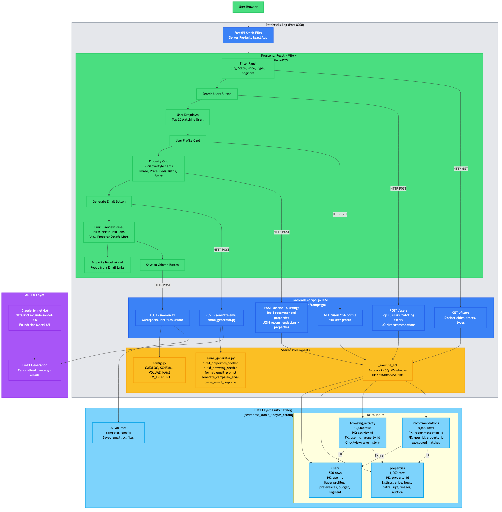
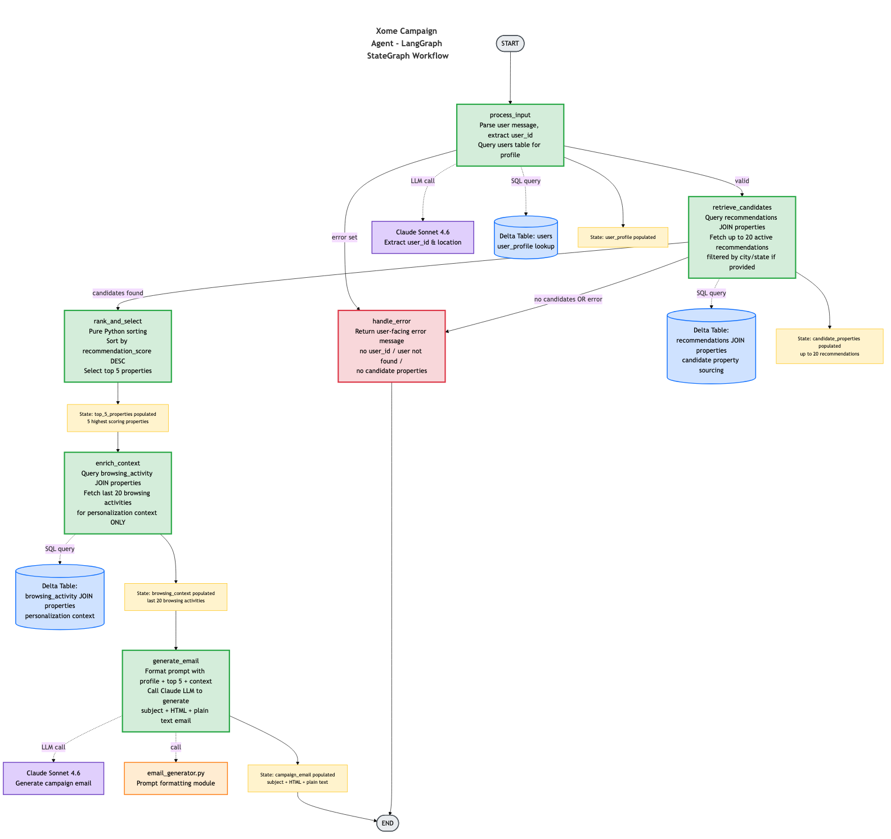

# Xome Campaign Platform

An AI-powered real estate campaign platform that generates personalized emails promoting recommended properties to high-intent buyers. Built with LangGraph + FastAPI on the backend, React + TailwindCSS on the frontend, deployed as a single-process Databricks App.




---

## How It Works

The platform offers **two independent paths** to generate campaign emails. Each path is self-contained — they do **not** call each other. The only shared piece is `email_generator.py` (prompt formatting, LLM invocation, response parsing).

### Path 1: Dashboard UI (REST API) — does NOT use LangGraph

The React frontend calls REST endpoints in `campaign_api.py` directly. Each endpoint runs its own SQL queries and orchestration. The LangGraph `StateGraph` is **never triggered** — the UI handles the step-by-step workflow through user interactions instead of an autonomous agent pipeline.

1. Use the filter sidebar to narrow down by city, state, price range, property type, or buyer segment
2. Click **Search Users** → calls `POST /api/campaign/users` to find matching high-intent buyers (top 20)
3. Select a user from the dropdown → calls `GET /api/campaign/users/{id}/profile` and `POST /api/campaign/users/{id}/listings` to load their profile and top 5 recommended properties
4. Click **Generate Email** → calls `POST /api/campaign/generate-email` which invokes Claude Sonnet 4.6 via `email_generator.py` to produce a personalized HTML email
5. Preview the email (HTML or plain text), click property links to see detail modals
6. Click **Save to Volume** → calls `POST /api/campaign/save-email` to persist the email as a `.txt` file in Unity Catalog

**Call chain:** `React UI → campaign_api.py (REST) → email_generator.py → Claude LLM`

### Path 2: Chat Agent (LangGraph) — does NOT use the REST API

A natural language message hits the `/invocations` endpoint, which triggers the LangGraph `StateGraph` pipeline. The REST API endpoints and React frontend are **never involved** — the agent autonomously handles all data fetching, ranking, and email generation through its 5-node graph.

1. Send a message to `/invocations`: _"Generate a campaign email for user `<user_id>`"_
2. The LangGraph agent runs: `process_input → retrieve_candidates → rank_and_select → enrich_context → generate_email`
3. Each node uses SQL tool functions from `tools.py` to fetch data, and the final node calls `email_generator.py` to generate the email

**Call chain:** `/invocations → agent.py (LangGraph StateGraph) → email_generator.py → Claude LLM`

### Why two paths?

The LangGraph agent (Path 2) was built first as a chat-based interface. The dashboard (Path 1) was added later to provide a visual, interactive experience where users can see property cards, apply filters, and preview emails — without needing to type natural language prompts. Path 1 bypasses LangGraph because the UI already controls the workflow step by step.

**Critical rule (both paths):** Campaign properties come exclusively from the `recommendations` table. Browsing data is used for personalization tone only.

---

## Architecture

```
                    ┌─────────────────────────────────────────────┐
                    │         Databricks App (Port 8000)          │
                    │                                             │
 Browser ──────────►│  FastAPI serves:                            │
                    │    ├── /assets/*        (static frontend)   │
                    │    ├── /*               (SPA fallback)      │
                    │    ├── /api/campaign/*  (REST API)          │
                    │    └── /invocations     (LangGraph agent)   │
                    └────────────┬────────────────────────────────┘
                                 │
                    ┌────────────▼────────────────────────────────┐
                    │           Shared Components                 │
                    │  email_generator.py  ←── used by both paths │
                    │  _execute_sql()      ←── Databricks SQL     │
                    │  config.py           ←── constants           │
                    └────────────┬────────────────────────────────┘
                                 │
              ┌──────────────────┼──────────────────┐
              ▼                  ▼                   ▼
    Claude Sonnet 4.6    Delta Tables          UC Volume
    (Foundation Model)   (users, properties,   (campaign_emails)
                         recommendations,
                         browsing_activity)
```

The app runs as a **single process** — FastAPI on port 8000 serves both the pre-built React frontend (from `frontend/dist/`) and all API endpoints. This is required because Databricks Apps only exposes one port.

---

## Project Structure

```
xome/
├── agent_server/                 # Backend application
│   ├── agent.py                  # LangGraph StateGraph (5 nodes, conditional edges)
│   ├── campaign_api.py           # REST API router (/api/campaign/*)
│   ├── email_generator.py        # Shared email generation logic (prompt building, LLM call, parsing)
│   ├── tools.py                  # SQL-backed tools (get_user_profile, get_recommendations, etc.)
│   ├── prompts.py                # System prompt + email generation template
│   ├── config.py                 # Constants (catalog, schema, warehouse, endpoints, metros)
│   ├── utils.py                  # Auth helpers, stream processing, _SanitizedChatDatabricks
│   ├── start_server.py           # FastAPI + MLflow AgentServer + static file serving
│   └── __init__.py
├── frontend/                     # React application (Vite + TailwindCSS)
│   ├── package.json              # Dependencies: react, vite, tailwindcss, lucide-react
│   ├── vite.config.ts            # Dev proxy /api → localhost:8000
│   ├── tailwind.config.js        # Xome color palette
│   ├── index.html
│   ├── .npmrc                    # npm registry mirror config
│   └── src/
│       ├── main.tsx
│       ├── App.tsx               # Root layout (Header + AppShell)
│       ├── index.css             # Tailwind directives + custom styles
│       ├── types/index.ts        # TypeScript interfaces
│       ├── api/campaign.ts       # Typed fetch wrappers for all REST endpoints
│       ├── lib/utils.ts          # formatPrice, formatDate helpers
│       └── components/
│           ├── layout/
│           │   ├── Header.tsx        # Xome branding bar
│           │   ├── Sidebar.tsx       # Left filter panel container
│           │   └── AppShell.tsx      # Top-level state management + orchestration
│           ├── filters/
│           │   ├── FilterPanel.tsx   # City, State, Price Range, Property Type, Segment
│           │   └── metros.ts        # City-to-state mapping for filter cascade
│           ├── users/
│           │   ├── UserDropdown.tsx      # Searchable dropdown, top 20 users
│           │   └── UserProfileCard.tsx   # Selected user summary card
│           ├── properties/
│           │   ├── PropertyCard.tsx      # Zillow-style card with image, price, stats, score bar
│           │   ├── PropertyGrid.tsx      # Responsive grid layout
│           │   └── PropertyDetailModal.tsx  # Detail popup from email links
│           └── email/
│               ├── EmailPreview.tsx  # Tabbed HTML/PlainText preview with click interception
│               └── EmailActions.tsx  # Generate + Save buttons with status indicators
├── notebooks/
│   ├── 01_generate_data.py       # Synthetic data generation (4 Delta tables, PK/FK constraints)
│   └── 02_genie_setup_instructions.py  # 10 SQL queries + Genie Space setup guide
├── scripts/
│   ├── quickstart.py             # Interactive setup (auth, MLflow experiment)
│   ├── start_app.py              # Concurrent frontend dev + backend launcher
│   └── discover_tools.py         # Databricks tool/resource discovery
├── databricks.yml                # Bundle config (app + experiment + job + Genie Space)
├── app.yaml                      # Databricks Apps runtime config (single process)
├── pyproject.toml                # Python dependencies and entry points
├── pipeline_flow.mmd             # Architecture diagram (Mermaid source)
├── pipeline_flow.png             # Architecture diagram (rendered)
├── langgraph_workflow.mmd        # LangGraph workflow diagram (Mermaid source)
└── langgraph_workflow.png        # LangGraph workflow diagram (rendered)
```

---

## Key Components

### Backend

#### `agent_server/agent.py` — LangGraph Pipeline

5-node `StateGraph` with conditional error routing:

| Node | Purpose | External Calls |
|------|---------|----------------|
| `process_input` | LLM extracts `user_id` from message, fetches user profile | Claude Sonnet 4.6, `users` table |
| `retrieve_candidates` | Fetches recommended properties (with optional city/state filter) | `recommendations JOIN properties` |
| `rank_and_select` | Sorts by `recommendation_score` DESC, picks top 5 | Pure logic |
| `enrich_context` | Fetches recent browsing activity for personalization | `browsing_activity JOIN properties` |
| `generate_email` | Generates HTML + plain text campaign email | Claude Sonnet 4.6 via `email_generator.py` |

Error handling routes to `handle_error` if: no valid user ID found, user not found in DB, or no recommendations exist.

State flows through `CampaignState` (a `TypedDict`): `messages`, `user_profile`, `candidate_properties`, `top_5_properties`, `browsing_context`, `campaign_email`, and `error`.

#### `agent_server/campaign_api.py` — REST API

FastAPI `APIRouter` with prefix `/api/campaign`:

| Method | Endpoint | Purpose |
|--------|----------|---------|
| `GET` | `/filters` | Distinct cities, states, property types, segments, price ranges |
| `POST` | `/users` | Top 20 users matching filters (joined with recommendation counts) |
| `GET` | `/users/{id}/profile` | Full user profile |
| `POST` | `/users/{id}/listings` | Top 5 recommended properties (optional city/state filter) |
| `POST` | `/generate-email` | Generate campaign email via Claude LLM |
| `POST` | `/save-email` | Save email to UC Volume via `WorkspaceClient.files.upload()` |

#### `agent_server/email_generator.py` — Shared Email Logic

Used by **both** the REST API and the LangGraph agent:

- `build_properties_section(properties)` — Format property details for the prompt
- `build_browsing_section(browsing)` — Format browsing activity for personalization
- `format_email_prompt(profile, properties, browsing)` — Build full LLM prompt
- `generate_campaign_email(llm, profile, properties, browsing)` — Invoke Claude and return parsed result
- `parse_email_response(raw)` — Parse `SUBJECT` / `HTML` / `PLAIN TEXT` sections from LLM output

#### `agent_server/tools.py` — SQL-Backed Tools

Three `@tool`-decorated functions that query Delta tables via Databricks SQL Statement Execution API:

- **`get_user_profile(user_id)`** — Single-row lookup from `users` table
- **`get_recommendations(user_id, city, state, limit)`** — JOINs `recommendations` with `properties`, sorted by score DESC
- **`get_browsing_context(user_id)`** — JOINs `browsing_activity` with `properties`, returns recent activity

All tools use a shared `_execute_sql()` helper calling `WorkspaceClient.statement_execution.execute_statement()`.

#### `agent_server/start_server.py` — Server Entry Point

- Loads `.env`, creates MLflow `AgentServer` with `enable_chat_proxy=False`
- Mounts the campaign API router
- Serves pre-built frontend from `frontend/dist/` with SPA fallback
- Handles `/assets/*` static files and `/{path}` → `index.html` for client-side routing

### Frontend

#### UI Layout

```
┌───────────────────────────────────────────────────────────┐
│  Header: Xome Campaign Platform                           │
├──────────────┬────────────────────────────────────────────┤
│ FILTERS      │ [User Dropdown ▼]     [User Profile Card] │
│              │────────────────────────────────────────────│
│ City    [▼]  │ Top Recommended Listings                   │
│ State   [▼]  │ ┌────────┐ ┌────────┐ ┌────────┐         │
│ Price [═══]  │ │  Card  │ │  Card  │ │  Card  │         │
│ Type    [▼]  │ └────────┘ └────────┘ └────────┘         │
│ Segment [▼]  │ ┌────────┐ ┌────────┐                     │
│              │ │  Card  │ │  Card  │                     │
│ [Search      │ └────────┘ └────────┘                     │
│  Users]      │────────────────────────────────────────────│
│              │ [Generate Email] [Save to Volume]          │
│              │ Email Preview (HTML | Plain Text tabs)     │
└──────────────┴────────────────────────────────────────────┘
```

#### Property Cards (Zillow-style)

- Full-width image (from `image_url` column or picsum.photos fallback)
- Status badge: green (Active), yellow (Pending), red pulsing (Auction)
- Price, beds/baths/sqft, address, neighborhood
- Recommendation score progress bar
- Auction banner with date and starting price (for auction listings)

#### Email Preview

- Tabbed view: HTML rendered in sandboxed iframe, plain text in `<pre>` block
- Click interception: injected script intercepts link clicks in the iframe, sends `postMessage` to parent, matches to a property by address, and opens a **PropertyDetailModal** popup instead of navigating away

---

## Data Model

```
users (500)                    properties (1,000)
  PK: user_id                    PK: property_id
  ├── preferred_city             ├── city, state, neighborhood
  ├── budget_min/max             ├── price, beds, baths, sqft
  ├── preferred_property_type    ├── listing_status (active/pending/auction/sold)
  └── user_segment               ├── auction_date, auction_start_price
                                 ├── image_url (picsum.photos)
        │                        └── description
        ▼                              │
browsing_activity (10,000)     recommendations (5,000)
  PK: activity_id                PK: recommendation_id
  FK: user_id -> users           FK: user_id -> users
  FK: property_id -> properties  FK: property_id -> properties
  ├── activity_type              ├── recommendation_score (0.0-1.0)
  ├── session_duration           ├── recommendation_reason
  └── device_type, referral      └── model_version, is_active
```

All tables are stored as Delta tables in Unity Catalog: `serverless_stable_14ey07_catalog.xome.*`

---

## Configuration

| Setting | Value |
|---------|-------|
| Catalog | `serverless_stable_14ey07_catalog` |
| Schema | `xome` |
| Workspace | fevm (`https://fevm-serverless-stable-14ey07.cloud.databricks.com`) |
| SQL Warehouse | `1f01d0f9de5b5108` |
| LLM Endpoint | `databricks-claude-sonnet-4-6` |
| Genie Space | `01f1484fd22e1d558c5ed706de7b522d` |
| UC Volume | `campaign_emails` (for saved email files) |
| App URL | https://agent-xome-campaign-7474645414452466.aws.databricksapps.com |

---

## How to Run

### Prerequisites

- [uv](https://docs.astral.sh/uv/) (Python package manager)
- [Node.js 20+](https://nodejs.org/) and npm
- [Databricks CLI](https://docs.databricks.com/dev-tools/cli/install.html) v0.283.0+
- A Databricks workspace with access to Foundation Model APIs

### Local Development

```bash
# 1. Clone the repo
git clone https://github.com/birbalin25/xome_first.git
cd xome_first

# 2. Create .env from template
cp .env.example .env
# Edit .env: set DATABRICKS_CONFIG_PROFILE=fevm

# 3. Run quickstart (sets up auth + MLflow experiment)
uv run quickstart --profile fevm

# 4. Install frontend dependencies
cd frontend && npm install && cd ..

# 5. Start the app (backend on :8000, frontend dev on :3000 with API proxy)
uv run start-app
```

Open http://localhost:8000 in your browser. During local development, the Vite dev server runs on port 3000 and proxies `/api` requests to port 8000.

### Build Frontend for Production

```bash
cd frontend && npm run build && cd ..
```

This creates `frontend/dist/` which FastAPI serves as static files in production.

### Test the REST API

```bash
# Get filter options
curl http://localhost:8000/api/campaign/filters

# Search users with filters
curl -X POST http://localhost:8000/api/campaign/users \
  -H "Content-Type: application/json" \
  -d '{"city": "Austin", "state": "TX"}'

# Get user profile
curl http://localhost:8000/api/campaign/users/USER_001/profile

# Get top recommended listings
curl -X POST http://localhost:8000/api/campaign/users/USER_001/listings \
  -H "Content-Type: application/json" \
  -d '{"city": "Austin", "state": "TX"}'
```

### Test the LangGraph Agent

```bash
curl -X POST http://localhost:8000/invocations \
  -H "Content-Type: application/json" \
  -d '{"input": [{"role": "user", "content": "Generate a campaign email for user USER_001"}]}'
```

### Deploy to Databricks

```bash
# Build frontend first
cd frontend && npm run build && cd ..

# Validate the bundle
databricks bundle validate --target prod

# Deploy resources (app, experiment, job)
databricks bundle deploy --target prod

# Deploy app source code
databricks apps deploy agent-xome-campaign --profile fevm \
  --source-code-path /Workspace/Users/birbal.das@databricks.com/.bundle/xome_campaign/prod/files

# Generate synthetic data (run once)
databricks bundle run xome_setup_pipeline --target prod
```

### Check App Status

```bash
# Status
databricks apps get agent-xome-campaign --profile fevm

# Logs
databricks apps logs agent-xome-campaign --profile fevm
```

---

## Notebooks

### `01_generate_data.py` — Synthetic Data Generation

Generates 4 Delta tables using Faker with:
- City-calibrated budgets and property prices
- Realistic browsing patterns (70% in preferred city)
- ML-scored recommendations with template explanations
- Valid image URLs via picsum.photos
- Primary keys and foreign key constraints

### `02_genie_setup_instructions.py` — Genie Space Queries

10 SQL analytics queries: most active users, price analysis by city/type, upcoming auctions, lapsed users for targeting, recommendation performance, browsing-to-bid conversion, property interest rankings, segment behavior comparison, device/channel engagement, auction vs standard performance.

---

## Dependencies

**Backend (Python):** `fastapi`, `databricks-langchain`, `mlflow>=3.10.0`, `langgraph`, `langchain-mcp-adapters`, `python-dotenv`, `faker` (data gen only)

**Frontend (Node.js):** `react`, `vite`, `tailwindcss`, `lucide-react`, `typescript`

---

## GitHub

Repository: https://github.com/birbalin25/xome_first
